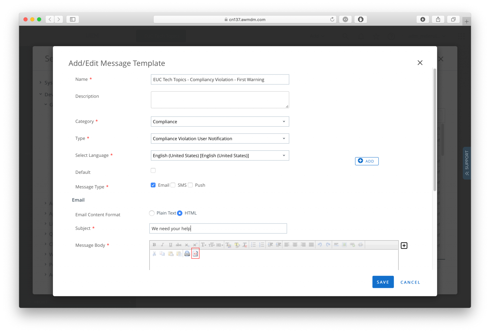

# Workspace ONE Custom Email Templates

* Author: Mathijs de Ruiter
* Email: mathijs.de.ruiter@fondo.nl
* Blog post: https://www.euctechtopics.com/custom-email-notifications-in-workspace-one-uem/
* Date Created: 6/8/2020
* Supported Platforms: WS1 UEM - All Versions

These email templates can be used as a starting point to create custom email notifications in Workspace ONE UEM. Where the basic ones provide the users with alot of information, it might be a better idea to incorporate your own company styling and languague. By doing this, the users will recognize and understand the emails. Whereas the default emails templates might come across as spam and/or phishing to some users. Included are templates for iOS Update Notifications and Compliancy Violations.

# Prerequisites

In order for you to fully leverage this templates, you need to host your company logo on some webserver. You could use imgur for this, or use some other static webserver for this.

# Configure templates in Workspace ONE

Start with logging into the Workspace ONE UEM console, go to All Settings > Devices & Users > General > Message Templates and clicking the +ADD button.

Press the <> icon in the editor to switch modes from WYSIWYG to HTML mode. Copy and paste the HTML code into the editor and make sure the type is set to Compliance Violation User Notification. Give the template a name and press Save. That's it, you can now use your custom template in compliance policies.