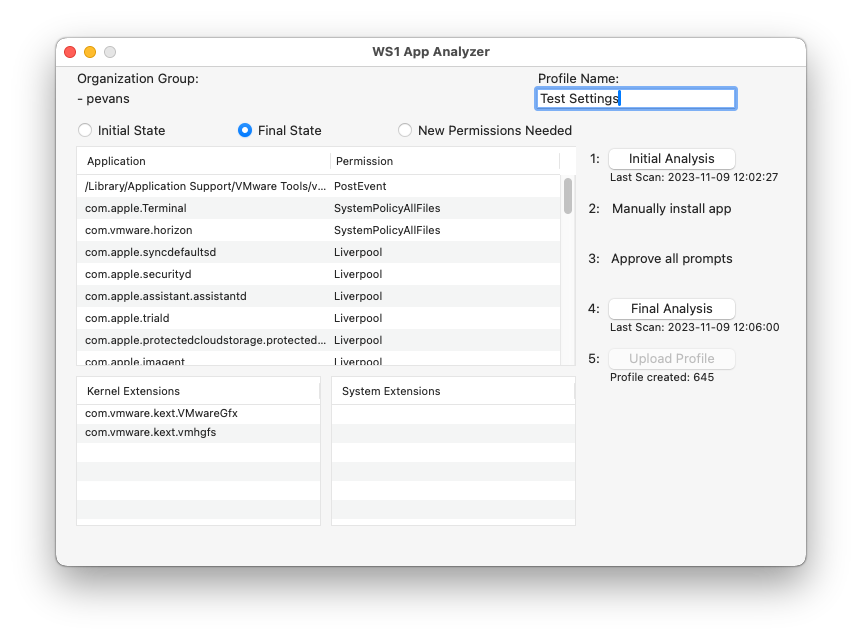

# Workspace ONE macOS App Analyzer

* Author: Paul Evans
* Date Created: 5/12/2020 (No longer receiving updates)
* Last tested on:
    * macOS Sonoma 14
    * Workspace ONE UEM 2306

## Summary
The Workspace ONE macOS App Analyzer will determine any Privacy Permissions, Kernel Extensions, or System Extensions needed by an installed macOS application, and can be used to automatically create profiles in Workspace ONE UEM to whitelist those same settings when deploying apps to managed devices.

## To connect to your Workspace ONE UEM environment:

1. From the menubar, select WS1 App Analyzer > Preferences.

2. Enter in the API information needed to connect to your Workspace ONE UEM environment:
	* URL: Your Workspace ONE UEM API URL (typically https://asxx.awmdm.com)
	* Key: Your API Key (created in the WS1 UEM Console under Settings > System > Advanced > API > REST API)
	* Username: The username for a WS1 UEM administrator account
	* Password: The password for a WS1 UEM administrator account

3. Select Test Connection to validate the connection is successful.

4. Select the appropriate Organization Group.  This is where uploaded profiles will be managed.

5. Select Save.  Note that the URL, Key, and Username, and Password will be saved in the device keychain.

## How to use the WS1 App Analyzer

1. Before installing the target macOS application, launch the WS1 App Analyzer and select the Initial Analysis button.  This will determine the configured Privacy Preferences, Kernel Extensions, and System Extensions already installed on the machine.
	* Note: The first time you perform an analysis, you will be prompted to allow the WS1 App Analyzer to send events to Terminal. Select OK.  If you do not, you may need to open  System Preferences > Security & Privacy > Privacy > Automation and enable "Terminal" under the WS1 App Analyzer line.
	* Likewise, Terminal needs full disk access in order to gather the appropriate information.  If you receive a prompt stating Terminal needs Full Disk Access, select Open System Preferences and enable "Terminal" under the "Full Disk Access" section.
	* If you need to enable either of the above settings, simply run the analysis again.  You should see a list of configured Privacy Preferences, Kernel Extensions, and System Extensions.

2. After performing the initial analysis, install the target macOS application on the same machine.  You can install the application through any method you prefer, such as manually performing the installation process or deploying the application through Workspace ONE UEM.

3. When the app is initially installed, manually proceed through any additional prompts to enable Privacy Preferences or approve Kernel or System Extensions.  Typical these prompts will appear automatically, but for some applications, they may not appear until certain actions are taken within the application.  If needed, feel free to reboot the machine to complete the installation.

4. Once the target macOS application has been fully installed and all system settings have been enabled/approved, select the Final Analysis button.  This will determine the new Privacy Permissions, Kernel Extensions, and System Extensions installed since the initial Analysis was performed.  By selecting the New Permissions Needed radio button, you will see a list of only the new settings.

5. In the table views, you can check or uncheck the permissions that you choose to add to a WS1 UEM profile.  Note that certain permissions cannot be enabled through MDM, and may be grayed out.  When you are ready, select Upload Profile to upload the profile to your WS1 environment.  Make sure you've given your profile a name, and configured the API settings in the above section.
	* Note: You can double-click any of the rows in the table view to get more information about the particular setting, such as the Code Requirement for Privacy Preferences or the path or Team ID for a Kernel or System Extension.
