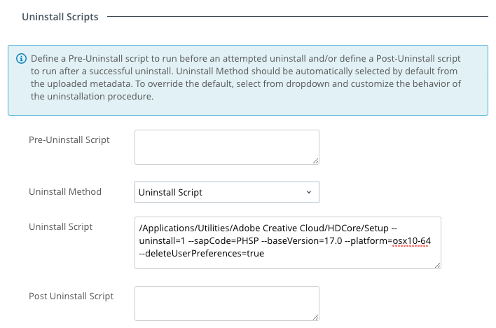

# Adobe Creative Cloud Suite #

## Overview
- **Authors**: Robert Terakedis, Daniel Machin
- **Email**: rterakedis@vmware.com, [@drmachin](https://twitter.com/drmachin)
- **Date Created**: 8/29/2018
- **Supported Platforms**: AirWatch version 9.6
- **Tested on macOS Versions**: macOS High Sierra (10.13.6)

## Purpose
When deploying Adobe Creative Cloud (CC) products with Workspace ONE UEM, admins should strongly consider using the integrated munki functionality built into "Internal Apps."   By using Internal Apps, admins gain the benefit of code which already understands the unique nature of the Creative Cloud app packages and handles them appropriately.  That said, as a macOS administrator, there is still some manual work which must be done to deliver these Adobe CC packages successfully.

*__NOTE:   Adobe recommends using Creative Cloud Packager to package a single application at a time.   In other words, you should have a "Photoshop" package, an "InDesign" package, a "Lightroom" package, etc.   Do not attempt to package the entire creative cloud suite into a single installer package.__*

## High Level Overview ##
The following describes the basic process for deploying an Adobe Creative Cloud app using the Creative Cloud Packager app for a serialized install.  This process may differ slightly if you use named-user licensing (feel free to update and send us a pull request! )

1. Use the Adobe Creative Cloud Packager to create a single app installer (e.g. Photoshop) From the Creative Cloud Packager:
    1. Create Package
    2. Enter Package Name (ex. Adobe Photoshop)
    3. License Type: Serial Number License
    4. Uncheck Creative Cloud Desktop Application
    5. Click Custom Settings Change
	    1. Change update behavior to "Admin users update via Adobe Update Manager"
	    2. Save
    6. Next
    7. Enter License Key
    8. Select Language (if necessary)
    9. Select Package(s)
    10. Build

2. From within the "Build" folder of the CCP output, take the installer PKG file and parse it with the VMware AirWatch Admin Assistant app.   The Admin Assistant should generate a folder in Documents: `~/Documents/VMware AirWatch Admin Assistant/AdobePhotoshop-19.1.6.398`

    *__NOTE: Not all of the Adobe packages (ex. Acrobat DC) include the necessary information for the pkginfo and will produce a folder with "(Please edit me!).  If this happens, you may need to edit the string value for the `<key>version</key>` key as follows:__*
    ```xml
        <key>version</key>
        <string>18.011.20055</string>
    ```

3. Modify the metadata plist file as follows:
   1. Set "Uninstallable" to `<true/>`
    ```xml
        <key>uninstallable</key>
        <true/>
    ```

   2. Modify the "installs" array with information pertinent to the actual application which is installed.  By default, the installs key points to a pimx file, but *should* instead contain information about the paths to the installed apps.  You can generate the installs information using the munki tools:  `makepkginfo -f /Applications/Adobe\ Photoshop\ CC\ 2018/Adobe\ Photoshop\ CC\ 2018.app` Copy the installs key/value and paste into the pkginfo plist. If the installs values already exist, replace them.  As an example:
    ```xml
        <key>installs</key>
        <array>
            <dict>
                <key>CFBundleIdentifier</key>
                <string>com.adobe.Photoshop</string>
                <key>CFBundleName</key>
                <string>Photoshop CC</string>
                <key>CFBundleShortVersionString</key>
                <string>19.1.6</string>
                <key>CFBundleVersion</key>
                <string>19.1.6.784</string>
                <key>minosversion</key>
                <string>10.11.0</string>
                <key>path</key>
                <string>/Applications/Adobe Photoshop CC 2018/Adobe Photoshop CC 2018.app</string>
                <key>type</key>
                <string>application</string>
                <key>version_comparison_key</key>
                <string>CFBundleShortVersionString</string>
            </dict>
        </array>
    ```

4.  When you upload the application to Workspace ONE UEM, set the *Uninstall Method* to *Uninstall Script* under the **Scripts** tab.

5. Set the *Uninstall Script* to the appropriate Adobe Uninstall Command line (per the "Deploy Packages" resource below).  As an example:  
    ```bash
        /Applications/Utilities/Adobe Creative Cloud/HDCore/Setup --uninstall=1 --sapCode=PHSP --baseVersion=17.0 --platform=osx10-64 --deleteUserPreferences=true
    ```
    

    *NOTE:   You can find the appropriate platform and sapCodes [here](https://helpx.adobe.com/enterprise/package/help/apps-deployed-without-their-base-versions.html)*


## Exceptions to the High Level Process ##

### Adobe Acrobat Pro DC 18.011

Adobe Acrobat requires some slight changes to function correctly in the Workspace ONE UEM framework.   

1. Updated Installs Array

    ```
        <key>installs</key>
        <array>
            <dict>
                <key>CFBundleIdentifier</key>
                <string>com.adobe.Acrobat.Pro</string>
                <key>CFBundleName</key>
                <string>Acrobat Pro DC</string>
                <key>CFBundleShortVersionString</key>
                <string>18.011.20055</string>
                <key>CFBundleVersion</key>
                <string>18.011.20055</string>
                <key>minosversion</key>
                <string>10.4.3</string>
                <key>path</key>
                <string>/Applications/Adobe Acrobat DC/Adobe Acrobat.app</string>
                <key>type</key>
                <string>application</string>
                <key>version_comparison_key</key>
                <string>CFBundleShortVersionString</string>
            </dict>
        </array>
    ```
2. Uninstaller Requires changes to the metadata plist direclty. Acrobat Pro DC does not follow the Uninstall process using SAPCodes as mentioned above.
    
    1. Review [Enterprise Administration Guide - Cmd line uninstalls](https://www.adobe.com/devnet-docs/acrobatetk/tools/AdminGuide/mac.html#cmd-line-uninstalls)
    2. Note the Uninstall commands for Acrobot DC Pro:
        ```
        "/Applications/Adobe Acrobat DC/Adobe Acrobat.app/Contents/Helpers/Acrobat Uninstaller.app/Contents/Library/LaunchServices/com.adobe.Acrobat.RemoverTool" "/Applications/Adobe Acrobat DC/Adobe Acrobat.app/Contents/Helpers/Acrobat Uninstaller.app/Contents/MacOS/Acrobat Uninstaller" "/Applications/Adobe Acrobat DC/Adobe Acrobat.app"
        ```
    3. you must edit the metadata plist directly to have the following:
        ```XML
        <key>uninstall_method</key>
        <string>uninstall_script</string>
        <key>uninstall_script</key>
        <string>#!/bin/sh
        "/Applications/Adobe Acrobat DC/Adobe Acrobat.app/Contents/Helpers/Acrobat Uninstaller.app/Contents/Library/LaunchServices/com.adobe.Acrobat.RemoverTool" "/Applications/Adobe Acrobat DC/Adobe Acrobat.app/Contents/Helpers/Acrobat Uninstaller.app/Contents/MacOS/Acrobat Uninstaller" "/Applications/Adobe Acrobat DC/Adobe Acrobat.app"
        </string>
        ```


## Troubleshooting


### Could not find uninstall info
* ManagedSoftwareUpdate.log shows:
    > WARNING: Could not find uninstall info for Adobe Photoshop CC 2018.

* FIX:  "uninstallable" is set to `<false/>` in the metadata plist output from VMware AirWatch Admin Assistant. Set the value to `<true/>` before uploading to console.


## Required Changes/Updates
None

## Change Log
- 8/29/2018: Created Initial File


## Additional Resources
- [Deploy Packages for Adobe® Creative Cloud™ created using Adobe Creative Cloud Packager](https://helpx.adobe.com/enterprise/package/help/deploying-packages.html)
- [Adobe Platform IDs and SAP Codes](https://helpx.adobe.com/enterprise/package/help/apps-deployed-without-their-base-versions.html)
- [Munki and Adobe CC - Munki Wiki](https://github.com/munki/munki/wiki/Munki-And-Adobe-CC)
- [Self-Service Adobe CC in Munki](https://osxdominion.wordpress.com/2016/10/19/self-service-adobe-cc-in-munki/)
- [Getting Started with Adobe CC in Munki](https://justanothermacadmin.com/2017/06/21/getting-started-with-adobe-cc-and-munki/)